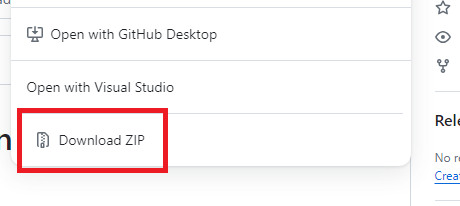

Instalação
=================

.. |nota| note::

    .. container:: numbered
        :name: 1.1

        1.1. Antes de instalar o Jogo da Forca, certifique-se de ter o Python instalado em sua máquina. Para baixar o Python, consulte o `site oficial <https://www.python.org/downloads/>`_.

    .. container:: numbered
        :name: 1.2

        1.2. Certifique-se de que o Python esteva no PATH do seu sistema operacional. Sujeito á erros na execução do projeto.

1. Baixe o repositório do Jogo da Forca.

2. Descompacte-o em um local de fácil acesso em sua máquina (recomenda-se fortemente 'Documentos').
3. Crie um ambiente virtual usando o comando: `python -m venv venv`.
4. Ative o ambiente virtual:

   - Para Windows, execute: `venv\Scripts\activate`
   - Para Linux/Mac, execute: `source venv/bin/activate`

5. Instale as dependências do projeto com o comando: `pip install -r requirements.txt`.

.. image:: _static/instalando-dependencias.pnj
    :alt: Instalando as dependências do projeto

Execução
-------------------------
Para executar o Jogo da Forca em sua máquina, siga estes passos:

- No prompt de comando, navegue até o diretório 'src' no diretório-raiz.

- Execute o comando 'python main.py' para iniciar o Jogo da Forca.

- Após executar o script da instrução anterior, você estará dentro do Jogo da Forca.

