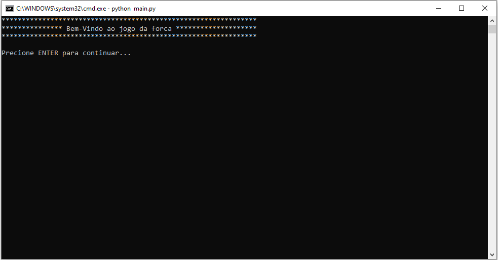
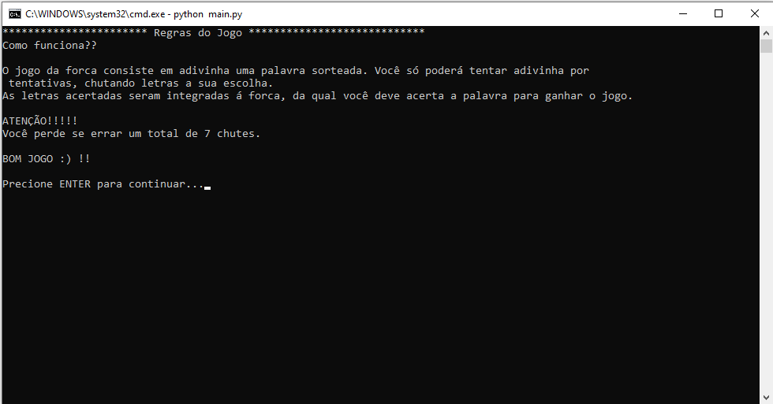
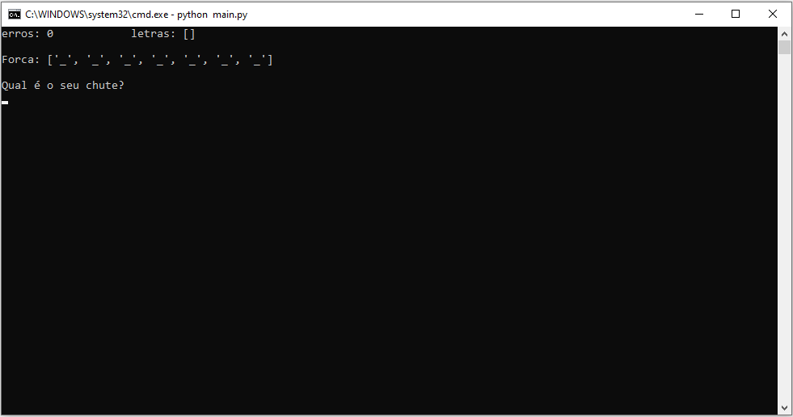
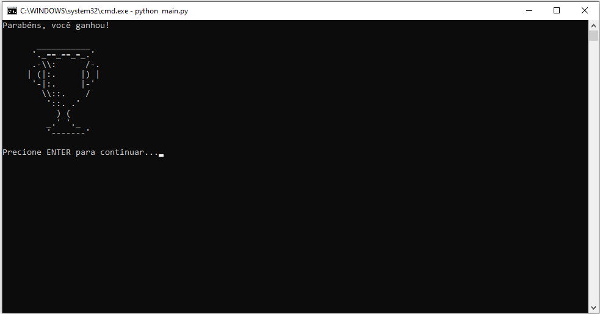
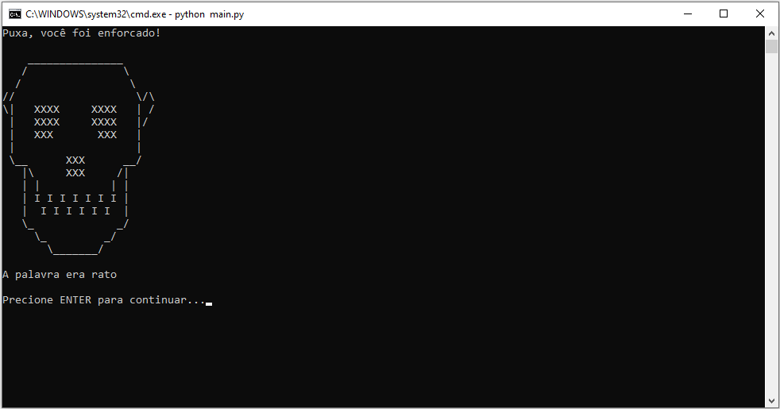
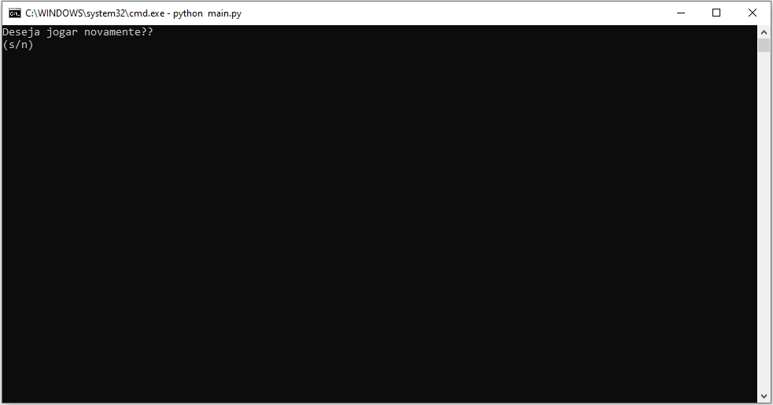
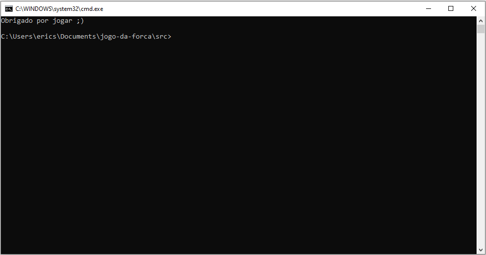

Guia Rápido
===========================

Abertura do Jogo da Forca
---------------------------

Uma tela simples exibirá a mensagem 'Bem-vindo ao jogo da forca'.

Regras do Jogo
--------------------------

Definição das regras do jogo:

Como funciona? \

O jogo da forca consiste em adivinhar uma palavra sorteada. Você terá um número limitado de tentativas para acertar a palavra, chutando letras de sua escolha. \
As letras corretas serão integradas à forca, que você deve completar para ganhar o jogo.

ATENÇÃO!!!!! \

Você perde se errar um total de 7 chutes. \

BOM JOGO :)

Execução da Rodada (Forca)
-----------------------------

Aqui acontece a execução da rodada.

Execução da Rodada
-----------------------------

.. image:: _static/execucao-da-rodada.png
        :alt: Execução da rodada

Mensagem de Fim de Jogo
-----------------------------

Ganhou!!
~~~~~~~~~~~~~~~~~~~~~~~~~~~~

Enforcou!!
~~~~~~~~~~~~~~~~~~~~~~~~~~~~

Deseja Jogar Novamente?
----------------------------

Fim do Jogo
~~~~~~~~~~~~~~~~~~~~~~~~~~~~

